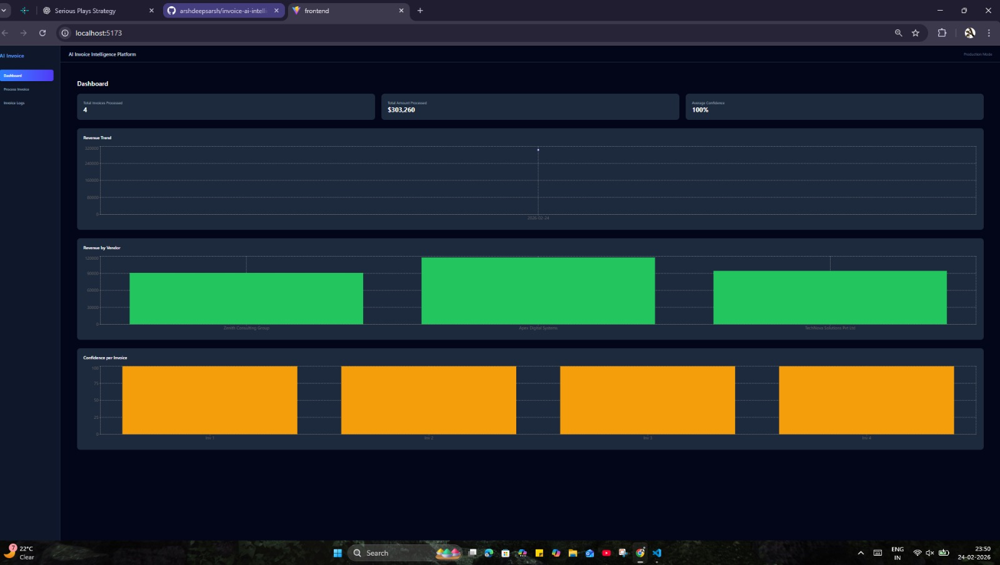
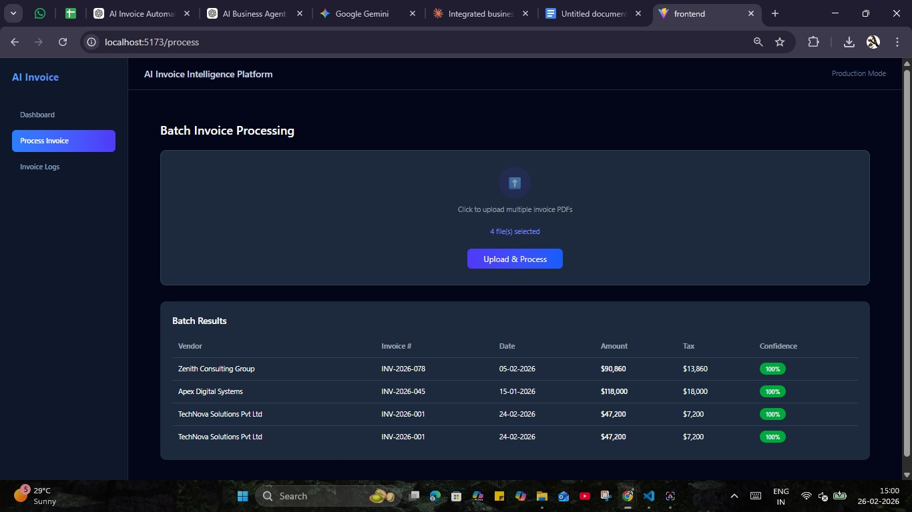
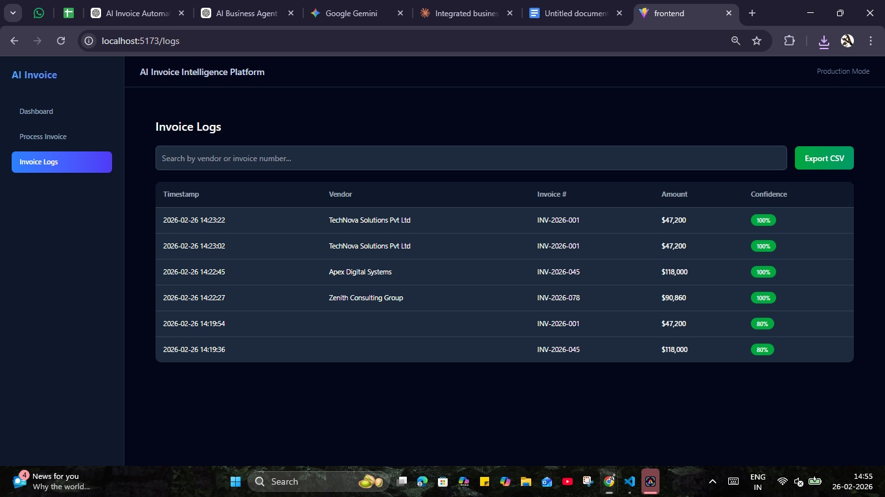

# 🚀 AI Invoice Intelligence Platform

A full-stack AI-powered invoice automation system built using:

- 🧠 Ollama (Local LLM - Qwen2 / Llama3)
- ⚡ FastAPI (Backend API)
- 🎨 React + Tailwind (Frontend SaaS UI)
- 📊 Recharts (Analytics Dashboard)

---

## 🔥 Features

- Upload single or multiple invoice PDFs
- Extract:
  - Vendor Name
  - Invoice Number
  - Invoice Date
  - Total Amount
  - Tax
- Structured JSON output
- Automatic confidence scoring
- Accuracy metric
- Processing time tracking
- Logs storage (JSON)
- CSV export
- Analytics Dashboard:
  - Revenue trend
  - Vendor revenue
  - Confidence visualization
- Fully local LLM using Ollama (No OpenAI API)

---

## 🔷 Detailed Processing Flow

1) Step-by-Step Execution
2) User uploads PDF
3) React sends POST request
4) FastAPI stores file
5) OCR extracts raw text
6) Text is chunked
7) Each chunk sent to Ollama
8) JSON results returned
9) Merge structured fields
10) Compute confidence + accuracy
11) Save to logs
12) Return response to frontend
13) UI updates dashboard

```bash
User
 │
 ▼
Upload PDF
 │
 ▼
FastAPI Endpoint (/process-invoice)
 │
 ▼
OCR Extraction
 │
 ▼
Text Chunking
 │
 ▼
Ollama LLM Processing
 │
 ▼
JSON Extraction
 │
 ▼
Confidence + Accuracy Calculation
 │
 ▼
Log Storage
 │
 ▼
Frontend Dashboard Update
```

---

## 🏗 Architecture

```bash
React (Cloud)
        │
        ▼
API Gateway
        │
        ▼
FastAPI (Dockerized)
        │
        ├── Worker Queue (Celery)
        │
        ├── Redis (Task Queue)
        │
        ├── PostgreSQL (Structured Logs)
        │
        └── Ollama Server (Dedicated GPU Machine)
```
---
## 📸 Product Screenshots

### 📊 Dashboard Overview


### 📈 Analytics & Revenue Insights


### 📁 Invoice Logs & CSV Export


---

## 🖥 Run Locally

### 1️⃣ Start Ollama

```bash
ollama serve
```
---

### 2️⃣ Start Backend

```bash
cd backend
uvicorn main:app --reload --port 8000
```

### 3️⃣ Start Frontend

```bash
cd frontend
npm install
npm run dev
```

---

## 📈 Tech Stack

```bash
| Layer   | Technology       |
| ------- | ---------------- |
| UI      | React + Tailwind |
| Charts  | Recharts         |
| Backend | FastAPI          |
| OCR     | PyMuPDF          |
| LLM     | Ollama           |
| Model   | Qwen2 / Llama3   |
| Storage | JSON / CSV       |
```

---

## 🟢 Frontend (React + Tailwind)

### Responsibilities:

- Invoice Upload (Single/Batch)
- Real-time Processing UI
- Dashboard Analytics
- Logs Table
- CSV Export Trigger
- Confidence Visualization

### Runs on:

```bash
http://localhost:5173
```
Communicates via REST API.

--- 

## 🔵 Backend (FastAPI)

### Responsibilities:

- Accept file uploads
- Store temporary files
- Extract text using OCR
- Chunk large documents
- Send structured prompts to LLM
- Merge extracted data
- Compute:
  - Confidence score
  - Accuracy metric
  - Processing time
- Save logs
- Serve CSV export

Runs on:

```bash
http://localhost:8000
```

---

## 🟣 OCR Layer

### Technology:

PyMuPDF (fitz)

### Purpose:

- Extract text from PDF pages
- Handle multi-page documents
- Provide raw text to LLM

---

## 🔴 LLM Layer (Ollama)

### Technology:
- Qwen2:1.5b (fast extraction)
- Llama3:8b (higher reasoning)

### Responsibilities:
- Structured field extraction
- JSON-only response
- Invoice understanding
- Vendor detection

Runs locally:
```bash
ollama serve
```

---

## 🟡 Processing Engine

### Inside extractor:
- Smart chunking (for large invoices)
- Per-chunk extraction
- Result merging
- Weighted confidence scoring

---

## 🟤 Storage Layer

### Currently:
- JSON logs file
- CSV export

--- 

## 📌 Future Improvements

- WebSocket live progress tracking
- Line-item extraction
- Vendor auto-classification
- Multi-user authentication
- Cloud deployment option
- PostgreSQL
- MongoDB
- Vector DB (for semantic invoice search)

---

## 🎯 Goal

Automate invoice data entry for accounting teams using local AI.

---
